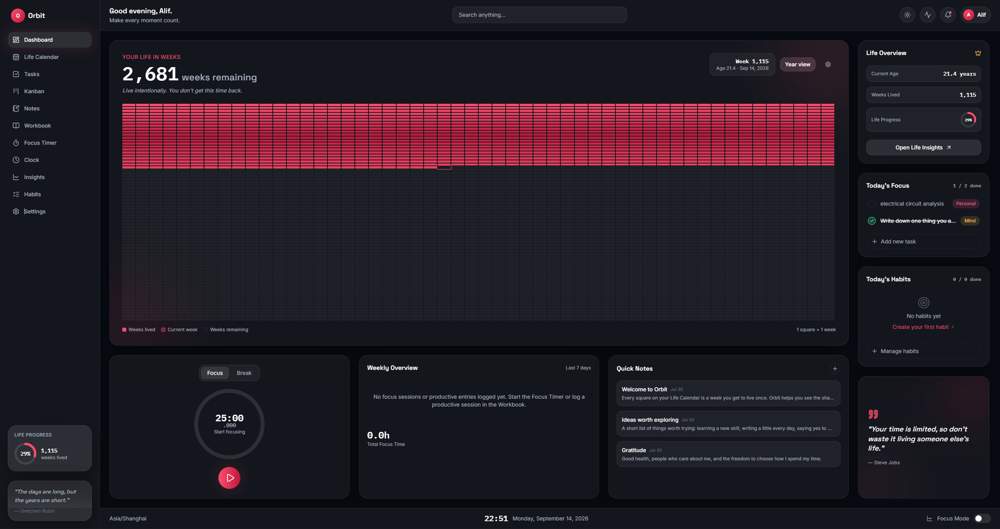

# Orbit — Own Your Time

<p align="center">
  
</p>

**Orbit** is a personal time-management and life-tracking dashboard built with React, TypeScript, and Appwrite. It helps you visualize your life in weeks, stay focused with a Pomodoro-style timer, manage tasks & notes, and gain insights into how you spend your most valuable resource — time.

## Routes

- `/` is the public Orbit landing page.
- `/login` and `/register` are public authentication screens.
- `/onboarding` is available to signed-in users completing their profile.
- `/app` and `/app/*` contain the protected Orbit workspace.

Unauthenticated visits to a protected route redirect to login and return to the originally requested page after a successful sign-in.

### ✨ Features

- **Life Calendar** — See your entire life in weeks. A powerful, humbling visualization inspired by _Your Life in Weeks_.
- **Focus Timer** — Built-in Pomodoro timer with session tracking to keep you in flow.
- **Task Management** — Kanban board and list views for organizing your work.
- **Quick Notes** — Jot down thoughts without leaving the dashboard.
- **Weekly Overview** — At-a-glance summary of your week's progress.
- **Insights** — Analytics and trends on your focus sessions and productivity.
- **Dark/Light Themes** — Beautiful glassmorphism UI with accent color customization.
- **Authentication** — Secure login, registration, and onboarding flow via Appwrite.

### 🛠 Tech Stack

| Layer         | Technology                         |
| ------------- | ---------------------------------- |
| Framework     | React 19 + TypeScript              |
| Build Tool    | Vite                               |
| Styling       | Tailwind CSS + Glassmorphism       |
| Backend       | Appwrite (Auth, Database, Storage) |
| Routing       | React Router v7                    |
| Animations    | Framer Motion                      |
| Icons         | Lucide React                       |
| Data Fetching | TanStack React Query               |

---

## 1) Install

```bash
npm install
```

## 2) Configure Appwrite

Create `.env.local` in the project root using `.env.example`:

```env
VITE_APPWRITE_ENDPOINT=https://cloud.appwrite.io/v1
VITE_APPWRITE_PROJECT_ID=your_project_id
VITE_APPWRITE_DATABASE_ID=your_database_id
VITE_APPWRITE_BUCKET_ID=your_bucket_id
```

Add `http://localhost:5173` and your production origin, such as `https://yourdomain.com`, to Appwrite project Platform settings.

## Deployment

Use one domain initially: host the landing page and authentication at `yourdomain.com`, with the signed-in app at `yourdomain.com/app/*`. Configure the hosting provider with an SPA fallback that rewrites every route, including `/app/habits`, to `index.html`; otherwise direct visits to nested routes will return a 404.

An `app.yourdomain.com` split can be introduced later if marketing and app deployments need separate ownership. Add every allowed development and production origin to Appwrite when that happens.

## 3) Run

```bash
npm run dev
```

## 4) Useful Scripts

```bash
npm run lint
npm run format
npm run build
```

## Project Layout

```
src/
├── assets/              # Static assets (images, screenshots)
├── components/
│   ├── dashboard/      # Dashboard widget cards
│   ├── layout/         # AppShell, Sidebar, Topbar, Footer
│   └── ui/             # Reusable UI primitives (Button, GlassCard, etc.)
├── config/             # Appwrite client configuration
├── context/            # React contexts (Auth, Theme, Accent, FocusTimer)
├── hooks/              # Custom hooks (useAuth, useTheme, useTasks, etc.)
├── lib/                # Utility libraries (life calendar, focus sessions)
├── pages/              # Route-level page components
├── services/           # Appwrite service helpers (auth, notes, tasks, profile)
└── types/              # TypeScript type definitions
```
